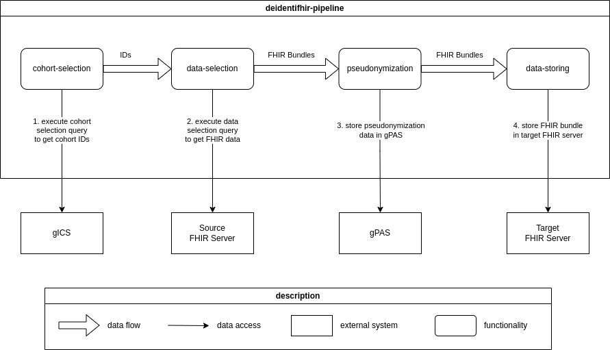

### DeidentiFHIR-Pipeline
With the DeidentiFHIR-Pipeline, you can transfer FHIR based data from one source (e.g. a FHIR server) to a target 
(e.g. a FHIR server) and pseudonymize the data in between. Pseudonymization is based on the 
[DeidentiFHIR library](https://github.com/UMEssen/DeidentiFHIR). 
The transfer consists of four steps:
1. **Cohort selection**: Select the IDs of FHIR resources (e.g. Patients) that should be transfered
2. **Data selection**: Fetch FHIR data that belongs to the selected cohort IDs
3. **Pseudonymization**: Pseudonymize the FHIR data based on [DeidentiFHIR profiles](https://github.com/UMEssen/DeidentiFHIR)
4. **Data storing**: Store the data in a target system

There can be multiple implementations for each step, e.g. a cohort selection could be based on consent policies stored 
in [gICS](https://www.ths-greifswald.de/forscher/gics/) or based on a list of IDs (e.g. Patient Identifiers). 
Which implementation should be used, can be configured in the [application.yaml](./src/main/resources/application.yaml).  
Available implementations can be found in the [transfer](./src/main/java/de/ume/deidentifhirpipeline/transfer/) folder. 

#### Architecture


#### Quickstart
Prerequisite:  
A running [gPAS](https://www.ths-greifswald.de/forscher/gpas/) instance on port 8081. 

Log in to Github Container Registry:
```bash
docker login ghcr.io
```
Start with: 
```bash 
docker compose up -d
```
Post testbundles to FHIR server:
```bash
./post-testbundle-to-fhir-server.sh
```
Start transfer: 
```bash
./start-configured-process.sh
```
Check if transfer was completed: 
```bash
curl http://localhost:8042/transfer/all
```
Check if bundle was transfered to the other FHIR server and a pseudonymized Patient resource exists: 
```bash
curl http://localhost:8083/fhir/Patient
```

#### Configuration
In `application.yaml`, see example in [src/main/resources/application.yaml](./src/main/resources/application.yaml):
```yaml
projects:
  "test-project1":
    parallelism: 16
    cohort-selection:
      via-ids:
        ids: ["1234"]
    data-selection:
      fhir-server:
        url: http://localhost:8082/fhir
        fhirIdQueryPlaceholder: <id>
        fhirIdQuery: Patient?identifier=<id>
        bundleQueryPlaceholder: <fhir-id>
        bundleQuery: Patient/<fhir-id>/$everything?_count=100000
    pseudonymization:
      deidentifhir:
        scraperConfigFile: <path/to/deidentiFHIR.profile>
        pseudonymizationConfigFile: <path/to/deidentiFHIR.profile>
        generateIDScraperConfig: true
        dateShiftingInMillis: 2419200000 # equals +/-14 days
        gpas:
          domain: test-project1-gpas-domain
          gpasServiceWsdlUrl: http://localhost:8081/gpas/gpasService?wsdl
          domainServiceWsdlUrl: http://localhost:8081/gpas/DomainService?wsdl
    data-storing:
      fhir-server:
        url: http://localhost:8083/fhir
```

#### What is needed for compilation: 
- `Java 21`
- `Maven`
- `docker`
- `docker compose`

#### Start with: 
```bash
mvn spring-boot:run
```

Compile project with:
```bash 
./build-jar.sh
```
Run with:
```bash
java -jar target/deidentifhir-pipeline-0.1.0.jar --spring.config.location=src/main/resources/application.yaml
```

#### For a complete development setup:
```bash 
cd integrationtests
docker-compose up -d
```

#### Endpoints:

POST:  
See [start-consent-process.sh](./start-consent-process.sh), 
[start-all-bundles-process.sh](./start-all-bundles-process.sh) or 
[start-custom-process.sh](./start-custom-process.sh)  
You get back a UUID which you can use to get the status of the transfer via GET requests.

GET:
- http://localhost:8042/transfer
- http://localhost:8042/transfer/all
- http://localhost:8042/transfer/{insert-uuid-here}
- http://localhost:8042/transfer/{insert-uuid-here}/failed
- http://localhost:8042/transfer/{insert-uuid-here}/completed
- http://localhost:8042/transfer/{insert-uuid-here}/pending

Endpoint documentation is also available as swagger-ui under 
[localhost:8042/swagger-ui/index.html](localhost:8042/swagger-ui/index.html).

#### Development setup:  
See `integrationtests/docker-compose.yml`

#### Examples:
Post bundles to FHIR server:
```bash
./post-all-bundles-to-fhir-server.sh
```
Start transfer:
```bash 
./start-all-bundles-process.sh
```
Check transfer with:  
http://localhost:8042/transfer/all


#### More: 
Generate `.jar`: 
```bash
mvn install 
```
Execute `.jar`:
```bash 
java -jar target/deidentifhir-pipeline-0.1.0.jar --spring.config.location=src/main/resources/application.yaml
```
