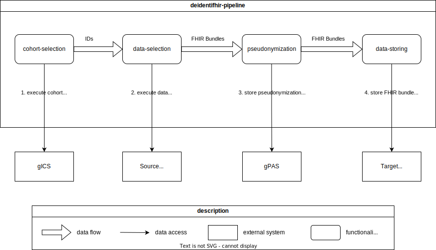

[](https://github.com/UMEssen/DeidentiFHIR-Pipeline/releases)
[](https://github.com/UMEssen/DeidentiFHIR-Pipeline/actions/workflows/maven-build-and-test.yml)
### DeidentiFHIR-Pipeline
With the DeidentiFHIR-Pipeline, you can transfer FHIR based data from one source (e.g. a FHIR server) to a target 
(e.g. a FHIR server) and pseudonymize the data in between. Pseudonymization is based on the 
[DeidentiFHIR library](https://github.com/UMEssen/DeidentiFHIR). 
The transfer consists of four steps:
1. **Cohort selection**: Select the IDs of FHIR resources (e.g. Patients) that should be transfered
2. **Data selection**: Fetch FHIR data that belongs to the selected cohort IDs
3. **Pseudonymization**: Pseudonymize the FHIR data based on [DeidentiFHIR profiles](https://github.com/UMEssen/DeidentiFHIR)
4. **Data storing**: Store the data in a target system

There can be multiple implementations for each step, e.g. a cohort selection could be based on consent policies stored 
in [gICS](https://www.ths-greifswald.de/forscher/gics/) or based on a list of IDs (e.g. Patient Identifiers). 
Which implementation should be used, can be configured in the [application.yaml](./src/main/resources/application.yaml).  
Available implementations can be found in the [transfer](./src/main/java/de/ume/deidentifhirpipeline/transfer/) folder. 

#### Architecture


#### Quickstart
Log in to Github Container Registry:
```bash
docker login ghcr.io
```
Start with: 
```bash 
docker compose up -d
```
Post testbundles to FHIR server:
```bash
./post-testbundles-to-fhir-server.sh
```
Start transfer: 
```bash
./start-configured-process.sh
```
Check if transfer was completed: 
```bash
curl http://localhost:8042/transfer/all
```
Check if bundle was transfered to the other FHIR server and a pseudonymized Patient resource exists: 
```bash
curl http://localhost:8083/fhir/Patient
```

#### Configuration
In `application.yaml`, see example in [src/main/resources/application.yaml](./src/main/resources/application.yaml):

#### Plugin mechanism
You can implement your own cohort-selection, data-selection, pseudonymization and data-storing. 
An example project is provided in the [plugin](./plugin) folder.  
You need to have access to the Github Package Registry, so the dependency can be found by maven.  
See the Github [docs](https://docs.github.com/en/packages/working-with-a-github-packages-registry/working-with-the-apache-maven-registry) for how to get access. 
When you have built the plugin jar with the `jar-build.sh` script, place the jar inside the `/plugin` folder in the docker container.  
The implementations will be then automatically loaded and can be used in the application.yaml. 

#### What is needed for compilation: 
- `java 24`
- `maven` (tested with `3.9.9`)
- `docker`
- `docker compose`

#### Configure maven for the Github Registry:
Generate a Github classic token with `read:packages` permissions and add this to your `.m2/settings.xml`: 
```
<servers>
  ...
  <server>
    <id>github-ume</id>
    <username>insert-github-username-here</username>
    <password>insert-token-here</password>
  </server>
  ...
</servers>
```
Docs and details can be found here: https://docs.github.com/en/packages/working-with-a-github-packages-registry/working-with-the-apache-maven-registry
#### Start with: 
```bash
mvn spring-boot:run
```

Compile project with:
```bash 
./jar-build.sh
```
Run with:
```bash
./jar-run.sh
```

Create docker image with: 
```bash
./docker-build-image.sh
```
#### Endpoints

POST:  
See [start-configured-process.sh](./start-configured-process.sh).  
You get back a UUID which you can use to get the status of the transfer via GET requests.

GET:
- http://localhost:8042/transfer
- http://localhost:8042/transfer/all
- http://localhost:8042/transfer/{insert-uuid-here}
- http://localhost:8042/transfer/{insert-uuid-here}/failed
- http://localhost:8042/transfer/{insert-uuid-here}/completed
- http://localhost:8042/transfer/{insert-uuid-here}/pending

Endpoint documentation is also available as swagger-ui under 
[http://localhost:8042/swagger-ui/index.html](http://localhost:8042/swagger-ui/index.html).

#### Development setup
See `integrationtests/docker-compose.yml`

#### Integrationtests
Integrationtests are executed with [hurl](https://github.com/Orange-OpenSource/hurl).  
Run with: 
```bash
cd integrationtests && ./start-integrationtests.sh
```

#### Examples
Post bundles to FHIR server:
```bash
./post-all-bundles-to-fhir-server.sh
```
Start transfer:
```bash 
./start-all-bundles-process.sh
```
Check transfer with:  
http://localhost:8042/transfer/all

